# 0WM 3D models

This repository contains all the 3D models used within the 0WM ecosystem.

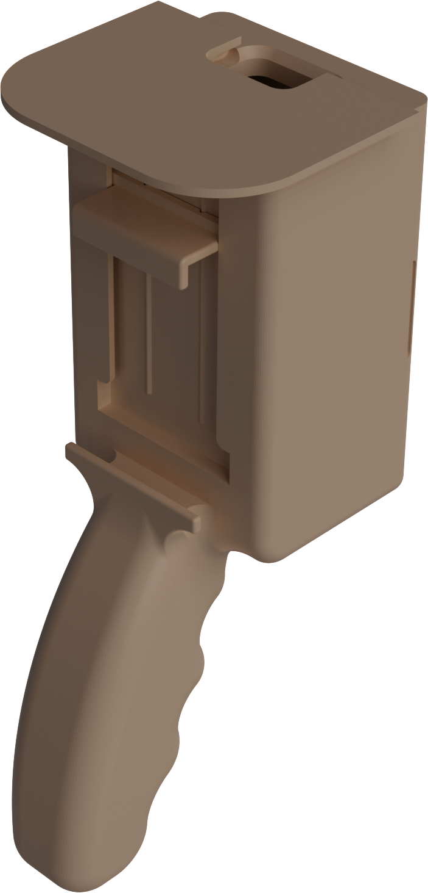
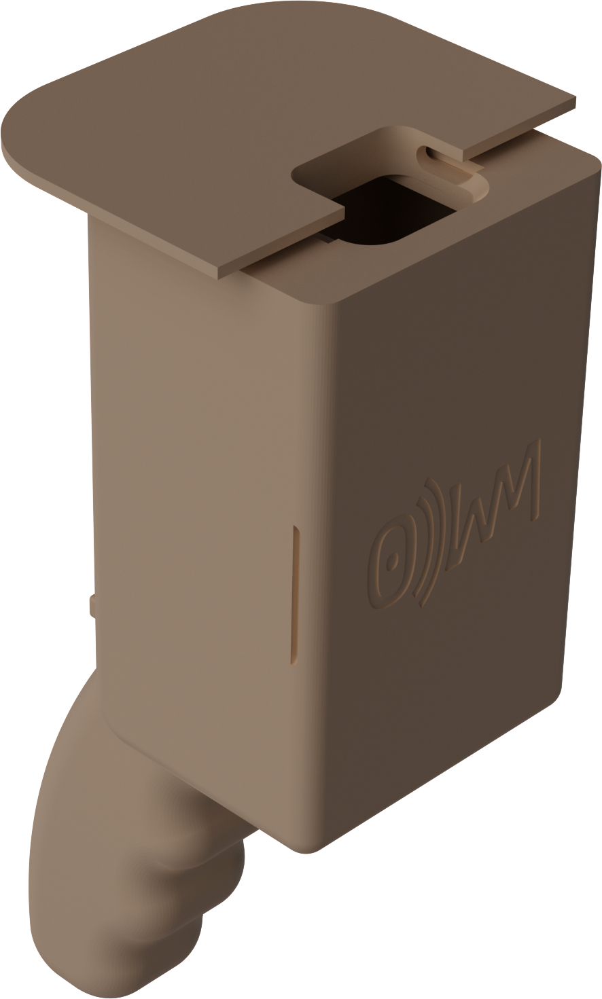

## Getting started

To properly build the 0WM scanner, four main components are needed:

* The [handle](#handle), made of two parts (left and right halves),
* The [phone mount](#phone-mount), made of two parts (mounting block and movable holder),
* The [AP mount](#ap-mount),
* The [cover](#cover).

The first two are generic and independent of the hardware used, but the last two respectively depend on your AP and on the energy source used to power it.

### Printing technology

All the parts in this repository have been designed to be printed using a resin printer (SLA), with a resolution of ⩽ 0.05 mm. Neither FDM nor SLS have been tried yet; feedback is more than welcome in the Issues section. The reference printer used to design, fine-tune, and validate the models in this repository is an Anycubic Photon D2 DLP printer.

### Choosing a resin and printing parameters

The handle, phone mount and cover need to be printed with a resin able to sustain some deformation. We strongly discourage using a standard brittle resin for those parts, and rather suggest a so-called tough or ABS-like resin. We have had the most success with, and thus recommend Anycubic’s ABS-Like Resin Pro 2.

We recommend a harder and less flexible (thus cheaper) resin for the AP mount, as it will be in large-tolerance (> 0.1 mm before resin shrinkage) contact with external parts and must not deform too much.

As with anything printed using a resin printer, care should be taken to properly clean, dry, and cure the parts, as errors (especially regarding duration) in these steps can greatly impact the final result.
After tinkering a lot with printing parameters and slicers, we actually found that the default parameters of our machine manufacturer’s (Anycubic) slicer were ideal for this project. In this slicer, we used heavy supports, with a 3 mm lift between the model and the raft.

## Contributing

The easiest way to contribute is to try these parts with your hardware (as long as the manufacturer is the same) and report in an issue if it is compatible, so that your hardware model gets added to the list of supported devices. Please do not report incompatibilities, as that will result in your issue being closed without comment.

Another way to contribute is to send to one of the repository maintainers agreeing to it the hardware you want to see supported, **without any expectation of getting it back** (consider it a donation). We will cover the modeling time and the resin cost necessary for our tests.

Finally, if you want to contribute with your own designs, feel free to open a PR; note however that for your design to be featured as supported, several users (or one repository maintainer) will have to confirm it is working as intended, with small tolerances, with the resins suggested in this guide.

## Printing and assembling the models

### Handle

|Flavor|Path|Overview|
|---|---|---|
|*Default*|[`Handle/Handle-Left.stl`](Handle/Handle-Left.stl), [`Handle/Handle-Right.stl`](Handle/Handle-Right.stl)|[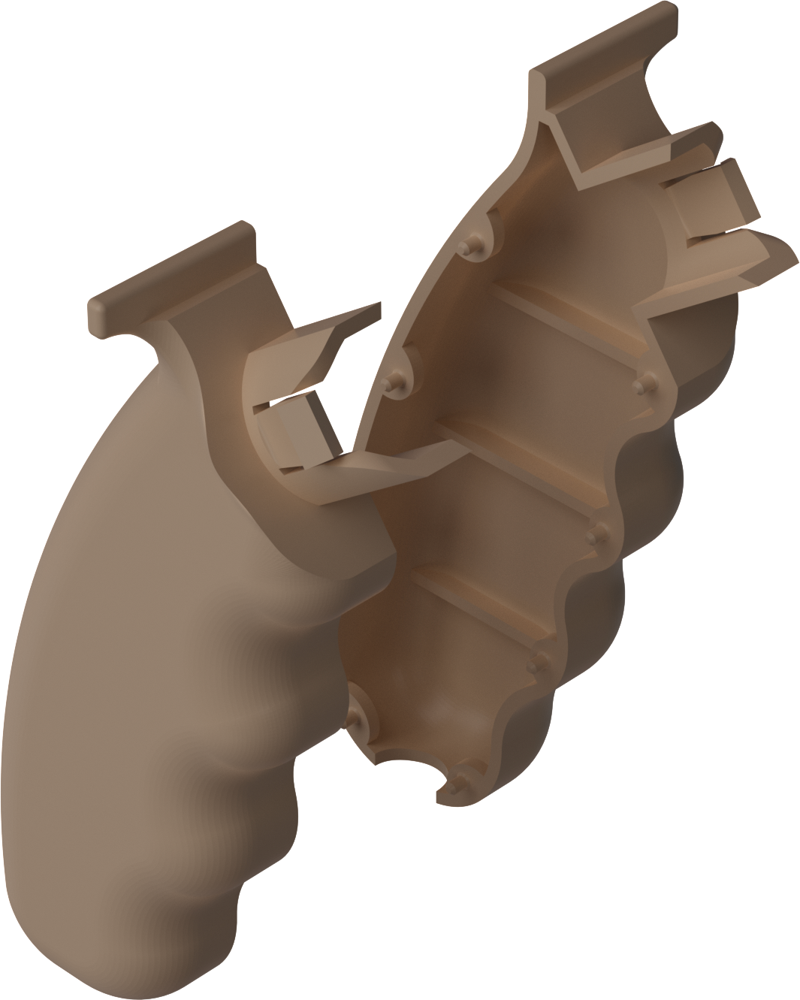](images/Handle.png)|

The scanner handle is made of two part: a left side and a right side, which need to be assembled together. We have no strong printing recommendations for these parts, but have found that placing the bottom of the handle closest and the protusion furthest to the build plate, finger grips facing opposite to the plate, worked well. Here is a **suggestion**:

[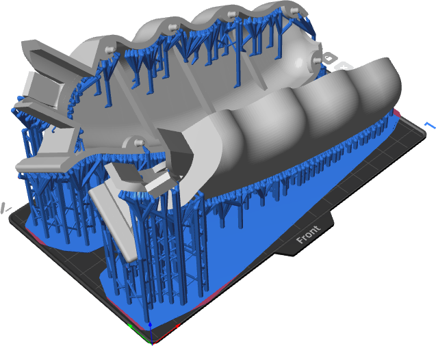](images/Handle-supported.png)

Before assembling the handle, if you want to run a power cord inside it, place it in one of the halves, then finish assembling.

### Phone mount

|Flavor|Path|Overview|
|---|---|---|
|*Default*|[`Phone-Mount/Mount.stl`](Phone-Mount/Mount.stl), [`Phone-Mount/Holder.stl`](Phone-Mount/Holder.stl)|[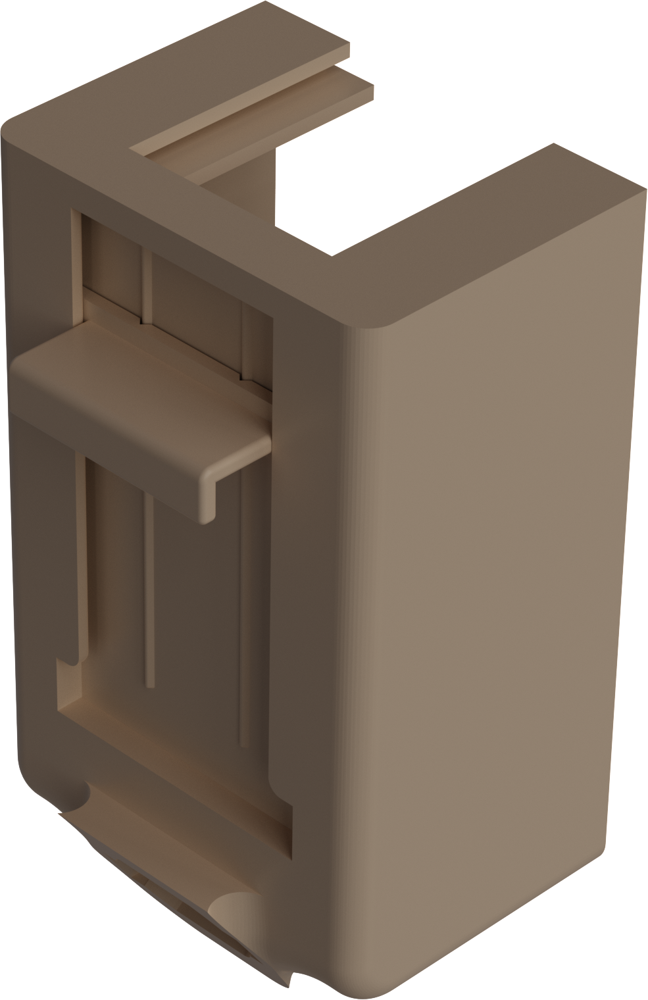](images/Phone-Mount.png)|

The phone mount is the part that needs the most care when printing, as it is the most expensive one of the build. We recommend to print the part with its flat top closest to the build plate, rotated 30° around the axis running from front to back. Except if you know exactly what you are doing, we do not recommend printing this piece flat, as its flat surfaces are too big (which does not work well with resin printing). There is a small additional part, the movable holder, which we suggest to print vertically (its longest edge parallel to the Z axis). Here is our **recommendation**:

[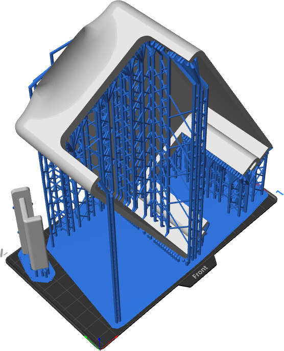](images/Phone-Mount-supported.png)

The phone mount is assembled with the handle by inserting the latter inside the former. A snap-fit mechanism locks the parts in place (hence the need for a good quality tough resin). If you are running a cord through the handle, you must pass it through the hole in the phone mount provided for this purpose.
The movable holder is then inserted at the back of the mount.

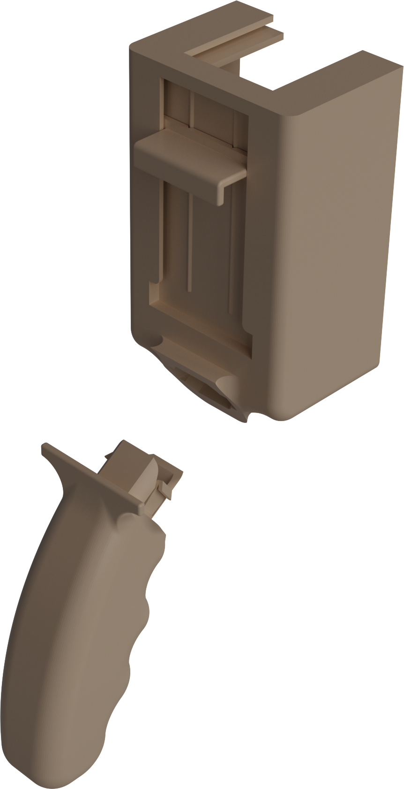

### AP mount

|Flavor|Compatibility|Path|Overview|
|---|---|---|---|
|[Zyxel](#ap-mount-zyxel)|Zyxel NWA50AX|[`AP-Mount/Zyxel.stl`](AP-Mount/Zyxel.stl)|[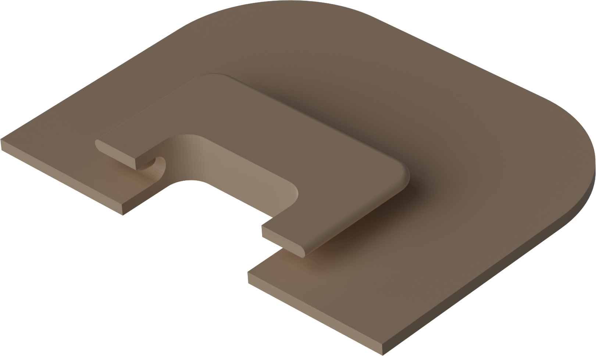](images/AP-Mount-Zyxel.png)|

The AP mount is the interface between the phone mount and the AP. It is designed in a specific way depending on the AP, and thus cannot be made general-purpose.

#### Zyxel

We recommend to print the AP mount vertically, with its two flat faces closest to the build plate, to minimize warping and reduce the need for supports as much as possible. Here is our **recommendation**:

The AP mount is assembled with the AP by locking it in place in the AP’s dedicated wall-mount slot. The overall locking is a bit loose, hence the need for a non-flexible resin.

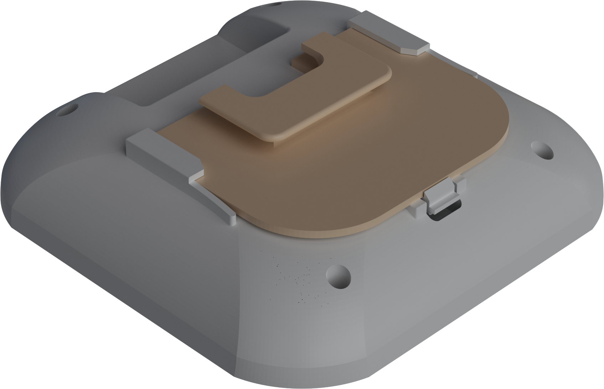

It is assembled with the phone mount by sliding its smooth side into the phone mount’s top slit. Sanding and repeated back-and-forth movements may be necessary before everything fits smoothly, which the tolerances we defined on those parts should easily allow.

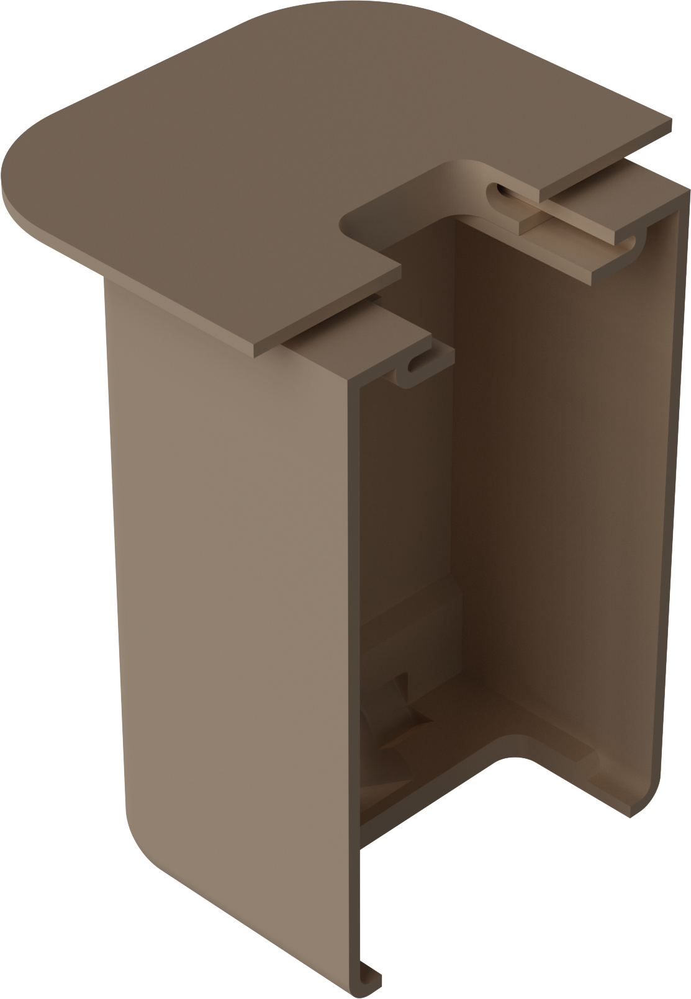

### Cover

|Flavor|Compatibility|Path|Overview|
|---|---|---|---|
|[Ubiquiti](#cover-ubiquiti)|Ubiquiti POE-48-24W-G-WH|[`Cover/Ubiquiti.stl`](Cover/Ubiquiti.stl)|[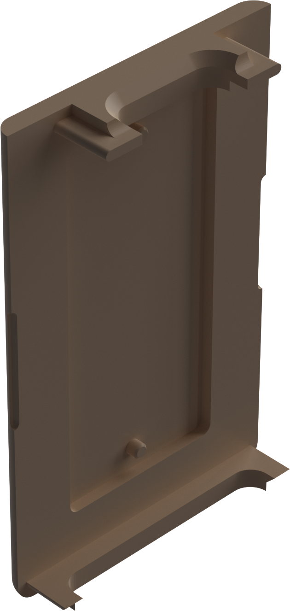](images/Cover-Ubiquiti.png)|

The last part of the 0WM scanner, and perhaps the strangest one, is its cover. It is used to mount anything power-related, such as PoE injectors or batteries. As with the [AP mount](#ap-mount), its design is hardware-specific, and thus cannot be made general-purpose.

#### Ubiquiti

We recommend to print the cover vertically, with its top face closest to the build plate, to minimize warping and reduce the need for supports as much as possible. Here is our **recommendation**:

[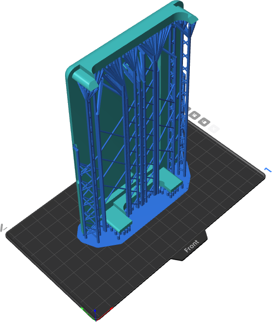](images/Cover-Ubiquiti-supported.png)

To assemble it to Ubiquiti’s PoE injector, put your injector in its wall mount. You will notice that the wall mount’s holes align with the cover’s pins; push the assembled PoE injector + wall mount into the cover, making sure that the Ethernet ports are on the cover’s top side and the power input is on the bottom side.

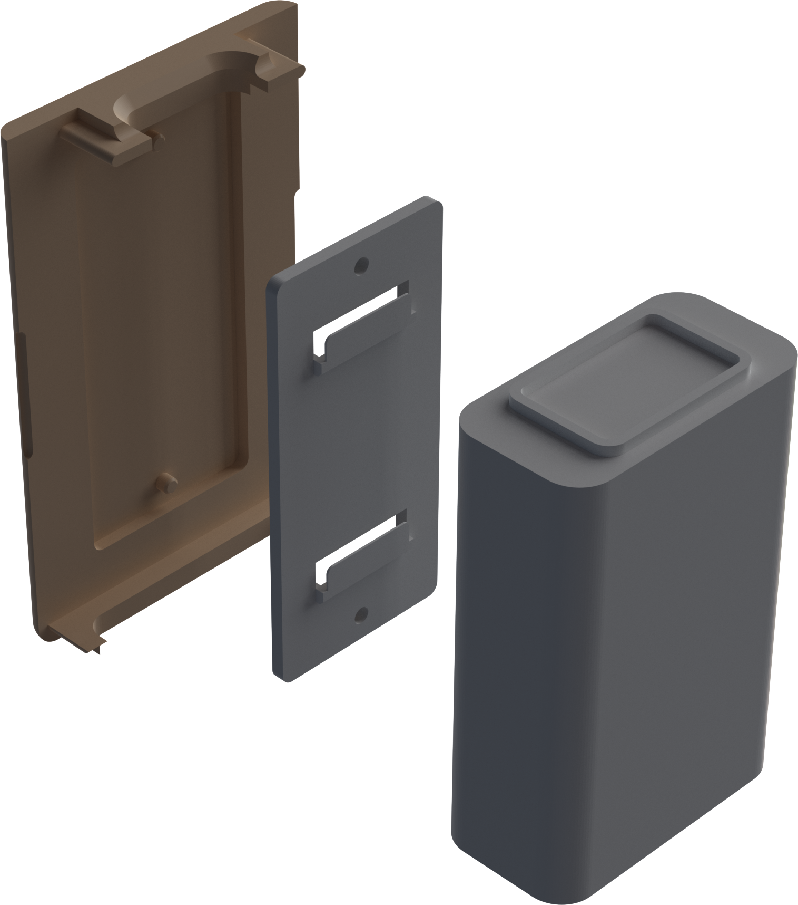

It is assembled with the phone mount by sliding it. If you are looking for a (semi-)permanent fit, little to no sanding may be needed, as the tolerances we defined on that part are aiming for a perfect fit (which due to the resin shrinking gives it a strong grip, although maybe too strong in your case). If you are looking for an easily removable cover, sand the top pins as needed (removing 0.1 to 0.2 mm may be necessary depending on your resin and curing method).

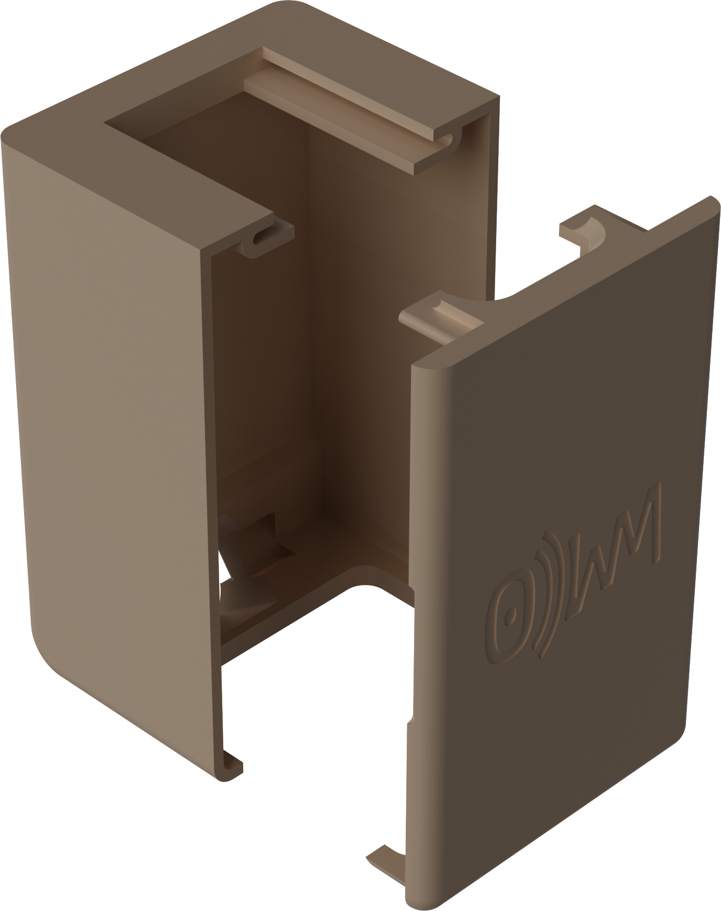

Before inserting the cover, think about how you want to plug your injector. You can either i) plug it directly through the bottom opening between the cover and the phone mount, or ii) through the handle (which we recommend). In the latter case, use the bottom opening to feed the cord through so that it does not bend too much:

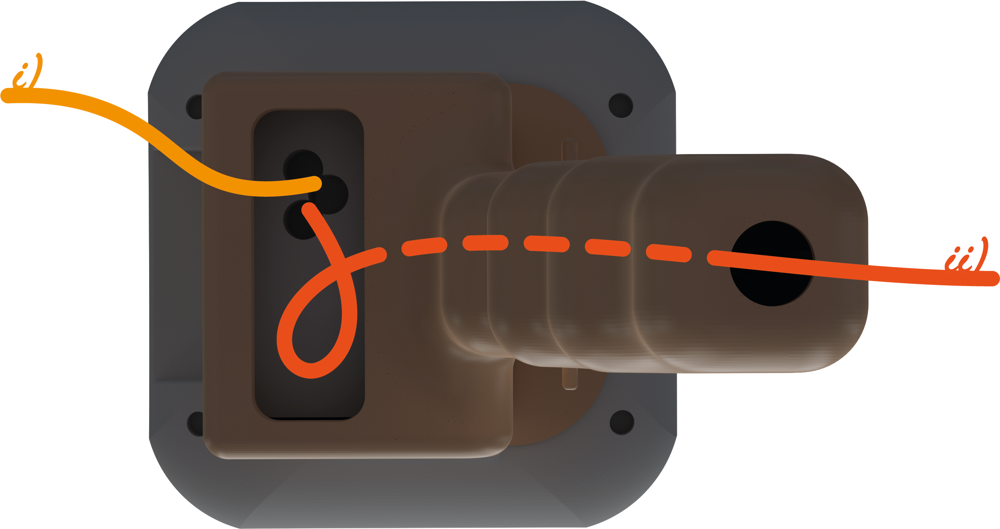

## Last steps

Lastly, you need to plug your AP to its power source, and link your phone and your AP, usually with an Ethernet cable and a USB-C to Ethernet adapter.

## Funding

This project is funded through [NGI Zero Core](https://nlnet.nl/core), a fund established by [NLnet](https://nlnet.nl) with financial support from the European Commission's [Next Generation Internet](https://ngi.eu) program. Learn more at the [NLnet project page](https://nlnet.nl/project/0WM).

